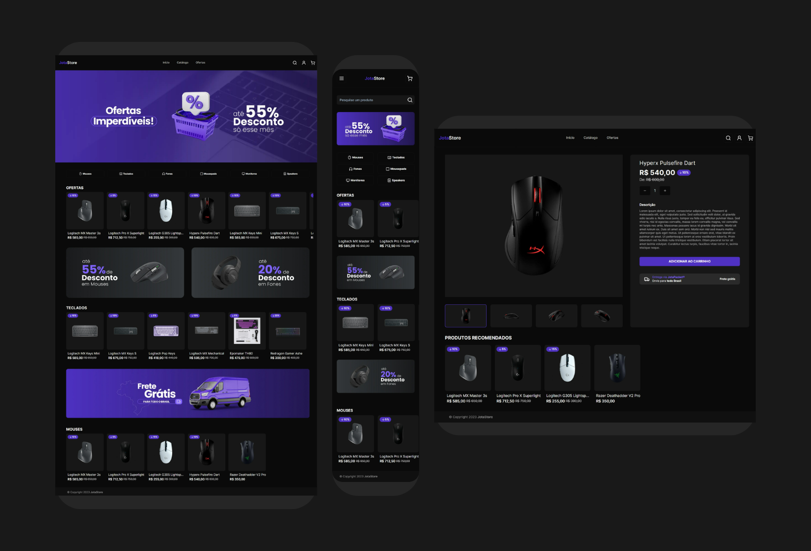

<h1 align="center">E-commerce | Jota Store</h1>

<h1 align="center">
    <a href="https://dj-fsw-store.vercel.app" target="blank">
        
        <small align="center">Clique para visitar o projeto🔗</small>
    </a>
</h1>

<h2>Descrição</h2>

E-commerce especializado em periféricos gamers, com produtos como teclados, mouses, headsets e monitores. O site oferece navegação intuitiva, filtros avançados, pagamento seguro e promoções exclusivas para otimizar setups de jogos.

## Tecnologias Utilizadas

- Next.js: Framework React para renderização do lado do servidor e geração de sites estáticos.

- React: Biblioteca JavaScript para criar interfaces de usuário com componentes reutilizáveis.

- TypeScript: Superset de JavaScript que adiciona tipagem estática, melhorando a segurança do código.

- Tailwind CSS: Framework de CSS utilitário para estilização rápida e responsiva.

- Shadcn UI: Biblioteca de componentes de UI com design moderno e acessibilidade.

- PostgreSQL: Sistema de gerenciamento de banco de dados relacional avançado e de código aberto.

- Prisma: ORM para Node.js e TypeScript que simplifica a interação com bancos de dados.

- Next-Auth: Autenticação de usuários

- Stripe: Plataforma de pagamentos para integrar soluções de pagamento em aplicações web.

## Funcionalidades

- Exibição de catálogo de produtos
- Carrinho de produtos
- Autenticação com o Google
- Busca de produtos
- Pagamento com cartão de crédito
